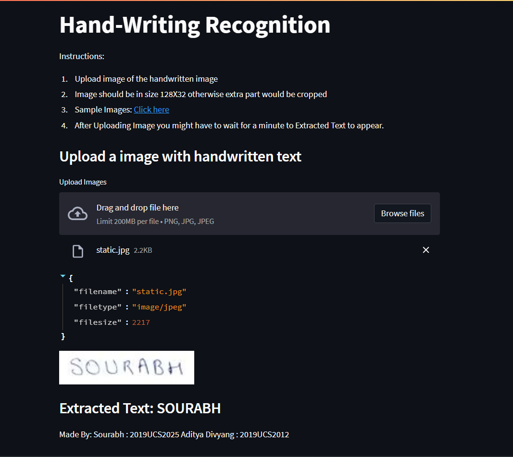
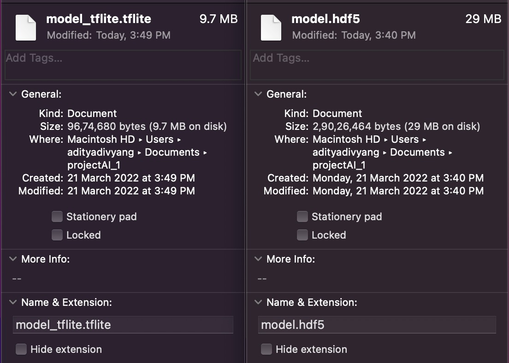

# Artificial Intelligence Hardware and Tools Workshop Project-1

Application hosted on Stream lit link: [Click Here](https://share.streamlit.io/sourabh112/handwriting-hosted/main/server.py)

# Screenshot of the Web Application:

## Architecture breakdown

1. The training and preprocessing part is in "handwriting recognition.ipynb" file
2. Webapplication and Predictions are in "Server.py" File

# Screenshot of the Comparison between H5 Model and Tflite Model:

Made By:
**Sourabh : 2019UCS2025**
**Aditya Divyang : 2019UCS2012**
